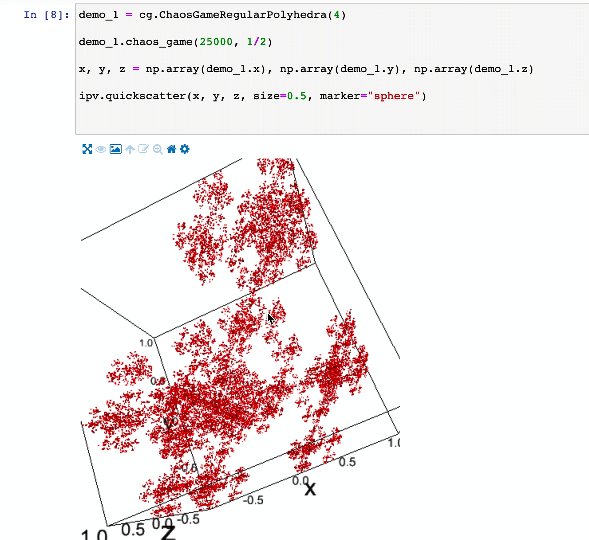
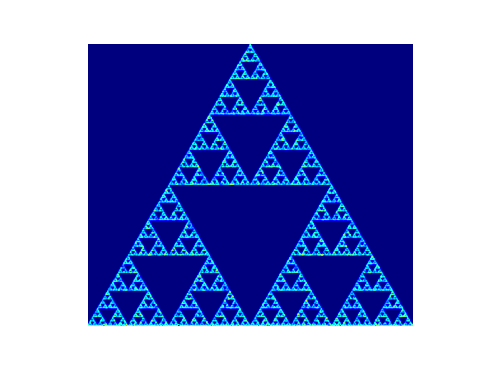
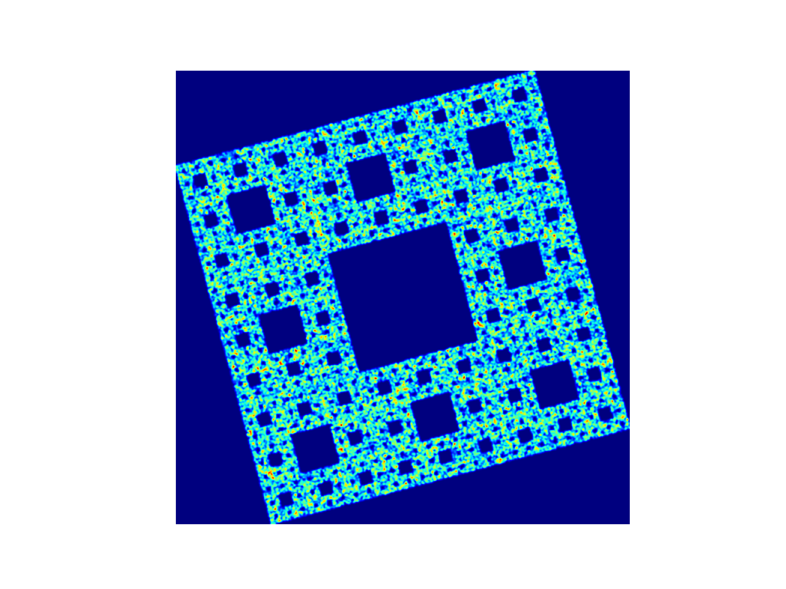
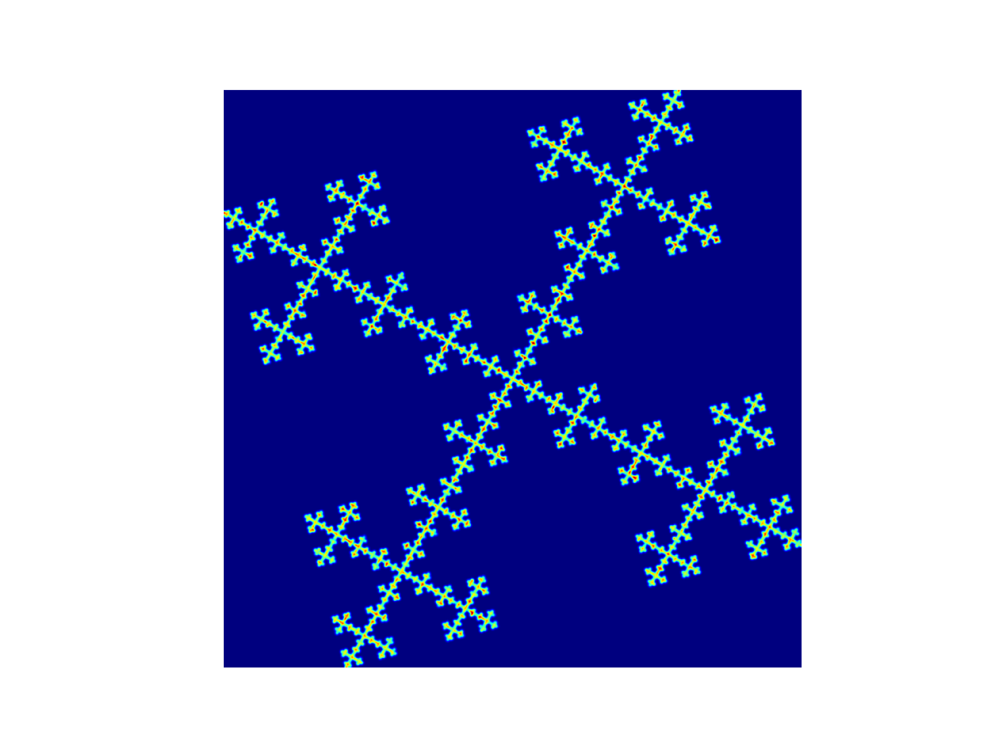

# Chaos Game

A chaos game generation library. Supports Jupyter Notebook.


## Features

- Create 2D and 3D fractals with chaos game
- Animate creation of chaos game fractals


## Requirements

- [GEOS](https://trac.osgeo.org/geos/)
    - Available on MacOS, Windows, Linuxes
- `pip install chaosgame`

## Jupyter Notebook

### View 3D chaos games (WIP)

Interactive 3d chaos game in Jupyter Notebook by [ipyvolume](https://github.com/maartenbreddels/ipyvolume).



## 2D samples

```python
from chaosgame.chaos_game import *
```

### The famous Sierpiński triangle

```python
# create regular polygon object with 3 vertexes (triangle)
cg = ChaosGameRegularPolygon(3)
# start chaos game with 10000 iterations and factor 0.5
cg.chaos_game(100000, 0.5)
# generate heatmap
cg.generate_heatmap()
```



### Sierpinski carpet

```python
cg = ChaosGameRegularPolygon(4)
cg.add_virtual_vertex(1)
cg.chaos_game(10000, 2/3)
cg.generate_heatmap()
```



### Vicsek fractal

You can even apply additional vertexes (points randomly picked during chaos game). In this case, a vertex is created in the center of the polygon.

```python
cg = ChaosGameRegularPolygon(4)
# create an additional vertex
cg.add_virtual_vertex(0)
cg.chaos_game(100000, 2/3)
cg.generate_heatmap()
```

